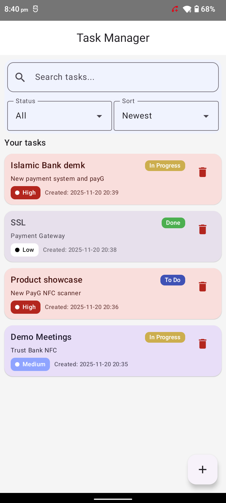
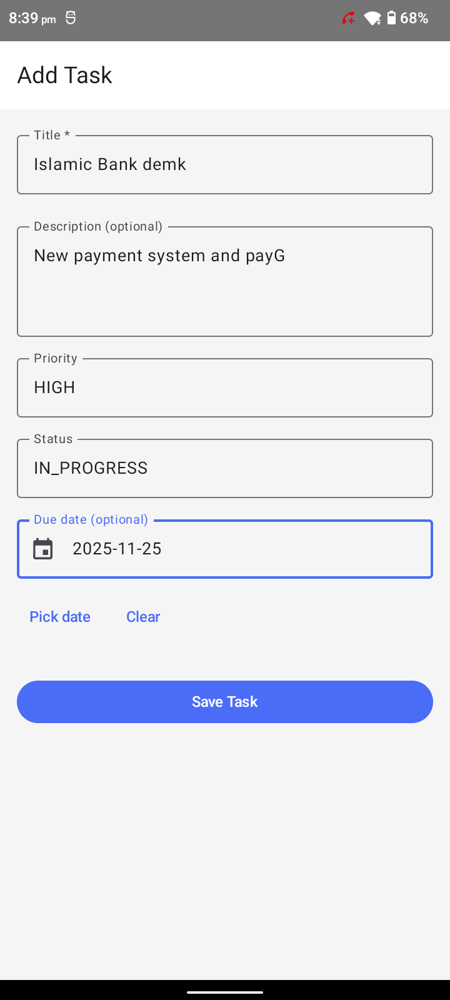
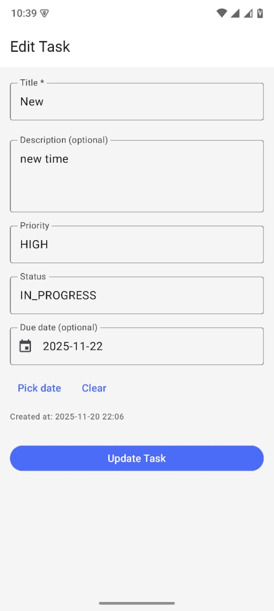

# KMM Task Manager

A simple **Task Management System** built with **Kotlin Multiplatform Mobile (KMM)**.  
The core business logic, data layer, and use cases live in a **shared KMM module**, while the Android app uses **Jetpack Compose + Material 3** for a modern UI.

---

## 📸 Screenshots

<p align="center">
  
  
  
</p>

---

## ✅ Features

### Task Management

- Create, read, update, and delete tasks
- Task fields:
    - **Title** (required)
    - **Description** (optional)
    - **Priority**: Low, Medium, High
    - **Status**: To Do, In Progress, Done
    - **Due date** (optional)
    - **Created timestamp** (auto-generated)

### UX / Functionality

- **List all tasks** with:
    - Filter by status (All, TODO, In Progress, Done)
    - Sort by:
        - Created date (Newest / Oldest)
        - Priority
        - Status
    - Search by title
- **Add / Edit screen**:
    - Title validation (cannot be empty)
    - Optional description
    - Priority selector
    - Status selector
    - Optional due date with date picker
    - Shows “Created at” for existing tasks
    - Success dialog on create/update
- **Offline support**: all tasks stored locally with SQLDelight
- Clean, simple UI using **Material 3**, custom colors and chips for:
    - Priority
    - Status
    - Created time

---

## 🧱 Architecture

The app follows a simple **clean-ish** structure inside the KMM shared module:

- **Domain layer**
    - `Task`, `Priority`, `TaskStatus`, `FilterOptions`, `SortMode`
    - Use cases:
        - `GetAllTasksUseCase`
        - `GetTaskByIdUseCase`
        - `CreateTaskUseCase`
        - `UpdateTaskUseCase`
        - `DeleteTaskUseCase`
        - `FilterTasksUseCase`
        - `SearchTasksUseCase`
        - `SortTasksUseCase`

- **Data layer**
    - SQLDelight database: `TaskDatabase`
    - Table: `tasks`
    - `TaskRepository` interface (domain)
    - `TaskRepositoryImpl` (data implementation)

- **Presentation layer**
    - Shared `TaskViewModel` (KMM)
    - `TaskUiState` holding:
        - List of tasks
        - Visible (filtered / searched / sorted) tasks
        - Current filter & sort options
        - Search query
        - Loading state

- **Android-specific**
    - `AndroidTaskViewModel` wrapping the shared VM
    - Jetpack Compose UI screens that observe `TaskUiState`

---

## 🧰 Tech Stack

### Shared (KMM) Module

- **Kotlin Multiplatform**
- **Coroutines** for async work
- **SQLDelight**:
    - Type-safe queries
    - Local database for offline support
- Shared domain & presentation logic

### Android App

- **Jetpack Compose** UI (Material 3)
- **Navigation Compose** for screen navigation
- **Android ViewModel** as a wrapper for shared ViewModel
- Custom theming:
    - Primary brand colors
    - Status chips (To Do / In Progress / Done)
    - Priority badges (Low / Medium / High)
- Modern components:
    - `TaskListScreen`
    - `AddEditTaskScreen`
    - `TaskItem`
    - `SearchBar`
    - Filter & Sort dropdowns

---

## 📁 Project Structure (Simplified)

```text
TaskManagementKMM/
│
├── shared/
│   ├── src/commonMain/kotlin/com/kmm/taskmanager/
│   │   ├── data/
│   │   │   ├── local/                # DatabaseDriverFactory
│   │   │   ├── model/                # TaskEntity
│   │   │   └── repository/           # TaskRepositoryImpl
│   │   ├── domain/
│   │   │   ├── model/                # Task, Priority, TaskStatus, FilterOptions, SortMode
│   │   │   ├── repository/           # TaskRepository interface
│   │   │   └── usecase/              # All task use cases
│   │   ├── presentation/             # TaskViewModel, TaskUiState
│   │   └── di/                       # SharedModule (if using DI)
│   └── src/commonMain/sqldelight/com/kmm/taskmanager/database/
│       └── TaskDatabase.sq
│
└── composeApp/  (Android app)
    ├── src/main/java/com/kmm/taskmanager/
    │   ├── TaskApp.kt
    │   ├── MainActivity.kt
    │   ├── navigation/               # Navigation setup
    │   ├── viewmodel/                # AndroidTaskViewModel
    │   └── ui/
    │       ├── screens/              # TaskListScreen, AddEditTaskScreen
    │       ├── components/           # TaskItem, SearchBar, Filter/Sort, PriorityBadge, StatusChip
    │       └── theme/                # Color, Theme, Typography
    └── src/main/AndroidManifest.xml
